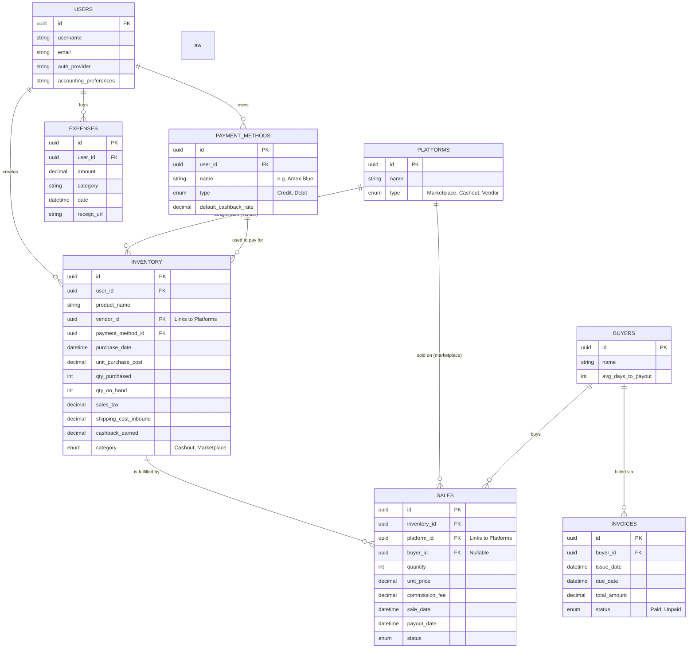

# Profit Tracker Database Schema Diagram
https://mermaid.live/edit#pako:eNpVjctugzAQRX_FmlUrQRQcHokXlRpos4nULrIqZGHBBKMEGxmjNAX-vYaoajurGZ1z7_SQqwKBwemirrng2pBDkkli5zmNha5aU_P2SFz3adihIbWSeBvI9mGnSCtU01SyfLz720kicb-fNCRGVPI83lE8598kDiRJ97wxqjn-JYerGshLWr0LW_-fCI029ZqeODtxN-eaxFzPCjhQ6qoAZnSHDtSoaz6d0E80AyOwxgyYXQuuzxlkcrSZhssPpeqfmFZdKcB2X1p7dU3BDSYVLzX_VVAWqGPVSQPMi-YKYD18Alv5wYJ6dBUtKQ1D3_McuAEL6MJfRX5EN-sw2CxpGIwOfM1Pl4t1FIzfsbNy9w

Based on the notes you've documented for the hybrid model (incorporating `inventory` and `sales` separation), here is the visual representation of how the database entities connect to form the system.

### Key Architectural Takeaways

- **Hybrid Inventory/Sales Split**: As noted in your design files, `INVENTORY` tracks the cost basis (money out), and when an item is sold, a corresponding `SALES` record is created (money in). When you record a sale, it subtracts the `quantity` sold from `INVENTORY.qty_on_hand`.
- **Platforms Multi-Use**: The `PLATFORMS` table acts as both vendors you buy from (Best Buy, Target) linked as `vendor_id` on Inventory, and marketplaces where you sell (eBay, Amazon) linked as `platform_id` on Sales.
- **Profit Calculation Join**: Profit is calculated dynamically by joining the Sales ledger with the original Inventory table to connect revenue generated with the exact cost basis of those goods.
