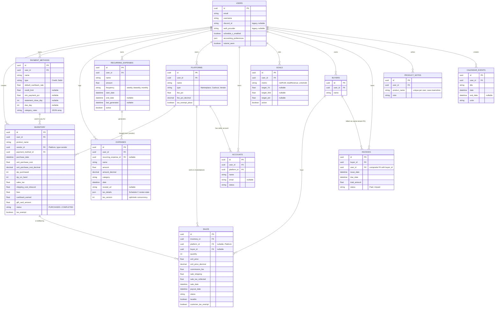

# Selvora Database Schema Diagram

Reflects `selvora-api/prisma/schema.prisma` as of 2026-09-30 (post currency-Decimal migration, post Firebase auth migration, post Buyer/Invoice tenant ownership). To regenerate a visual diagram, paste the Mermaid block below into [mermaid.live](https://mermaid.live) — the previous version of this file linked a pre-rendered diagram that encoded the stale schema below and has been removed rather than left misleading.

## Core business entities

`EbayPriceCache` (mapped to table `ebay_price_cache`) is standalone, keyed by `product_name` (no FKs): caches `last_sold_price`/`last_sold_price_decimal` with a 24-hour TTL via `fetched_at`.

## Auth & session models (no business-data FKs)

Added by the Discord-to-Firebase auth migration. All relate 1:1 or many:1 to `User`, with no relation to any business entity above.

| Model | Purpose |
|---|---|
| `FirebaseIdentity` | Links a `User` 1:1 to a Firebase project UID. |
| `FirebaseSession` | An active/revoked Firebase session cookie, keyed by hashed fingerprint; belongs to `FirebaseIdentity`. |
| `LocalCredential` | Legacy local username/password credential (1:1 with `User`, PK = `user_id`); used only for the migration path onto Firebase. |
| `AuthIntent` | Short-lived, single-use token binding a login/signup/migration attempt before Firebase token exchange. |
| `MigrationApproval` | Owner-granted, time-limited approval letting a specific Firebase identity link to an existing local account. |
| `AuthAttemptBucket` | Sliding-window rate-limit counter for auth endpoints. |
| `user_sessions` | Express session store table, fully managed by `connect-pg-simple` (`@@ignore`d by Prisma). |

## Currency precision mirrors

Every model with money/rate fields above (`Inventory`, `Sales`, `Platform`, `PaymentMethod`, `Expense`, `RecurringExpense`, `Invoice`, `Goal`, `EbayPriceCache`) has a parallel `Decimal` column per field (`*_decimal`, shown only on `Inventory.unit_purchase_cost` and `Sales.unit_price` above for brevity), kept exactly in sync by database triggers and substituted into every API response. See the root `README.md`'s "Currency precision" section and `qa/CURRENCY_MIGRATION_AUDIT.md`.

## Key architectural notes

- **Hybrid Inventory/Sales split**: `INVENTORY` tracks the cost basis (money out); a `SALES` row records money in against it and decrements `INVENTORY.qty_on_hand`. Both are written inside a single Prisma transaction with an optimistic-concurrency claim on quantity, so a failed or concurrent write can't leave a partial record or oversell.
- **Platforms are multi-use**: the `PLATFORMS` table is vendors you buy from (`vendor_id` on Inventory), marketplaces/cashouts you sell on (`platform_id` on Sales), and the parent of seller `ACCOUNTS` — all the same model, distinguished by `type`.
- **Every related ID is ownership-checked**: vendor, payment method, sale platform, and buyer IDs are verified to belong to the requesting user (`services/ownership.js`) before being attached to a record, not just the primary record itself.
- **Profit calculation** joins the Sales ledger with its Inventory row to connect revenue with the batch's cost basis, allocated proportionally for multi-unit batches; the formula lives in one shared module (`shared/finance.mjs`, with a Decimal-exact backend mirror in `services/decimalFinance.js`) consumed consistently everywhere it's displayed.
- **Buyer/Invoice are tenant-owned**: both carry `user_id`, with `Invoice.buyer` enforced as a composite FK on `(buyer_id, user_id)` so a buyer and its invoice can never belong to different users. No API route reads/writes `Invoice` yet — the ownership column is in place but unexercised.
